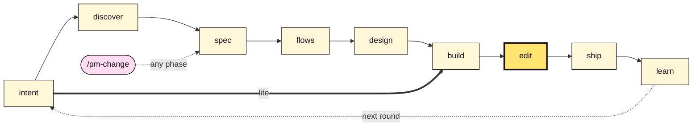
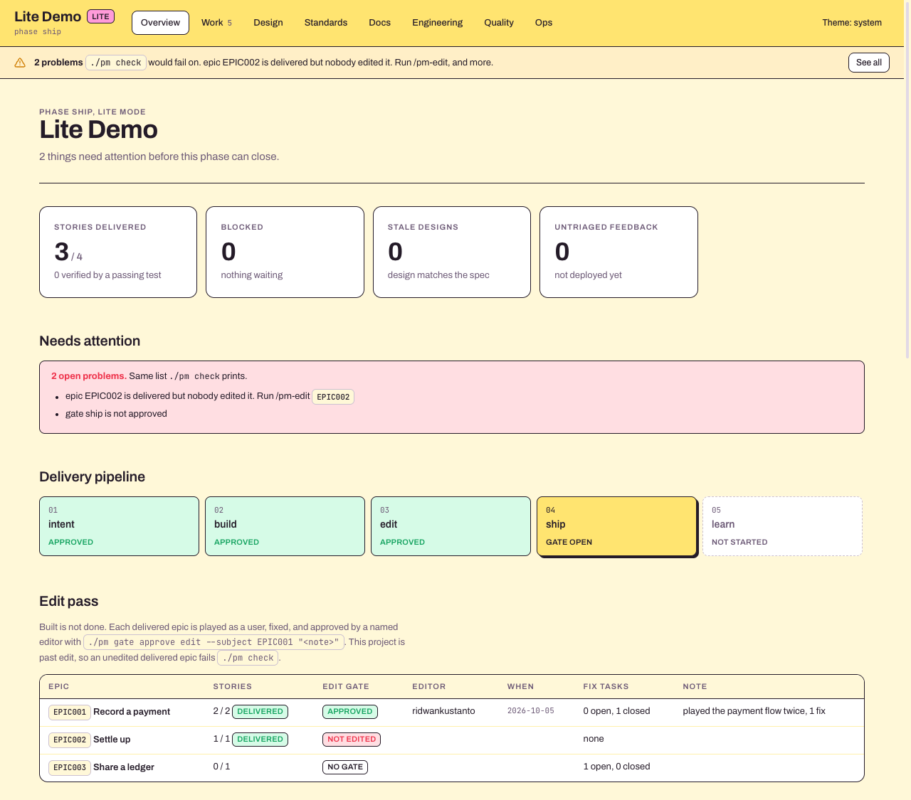
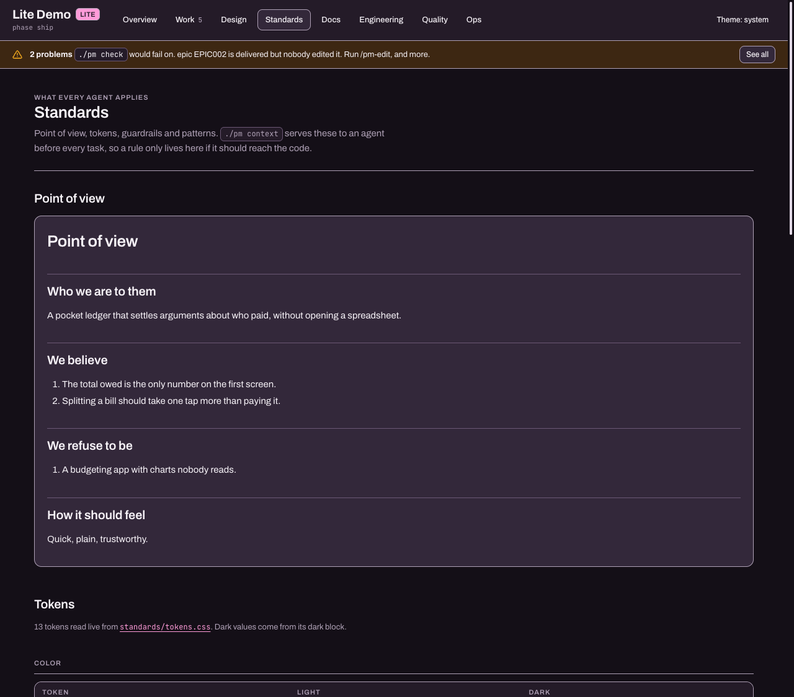
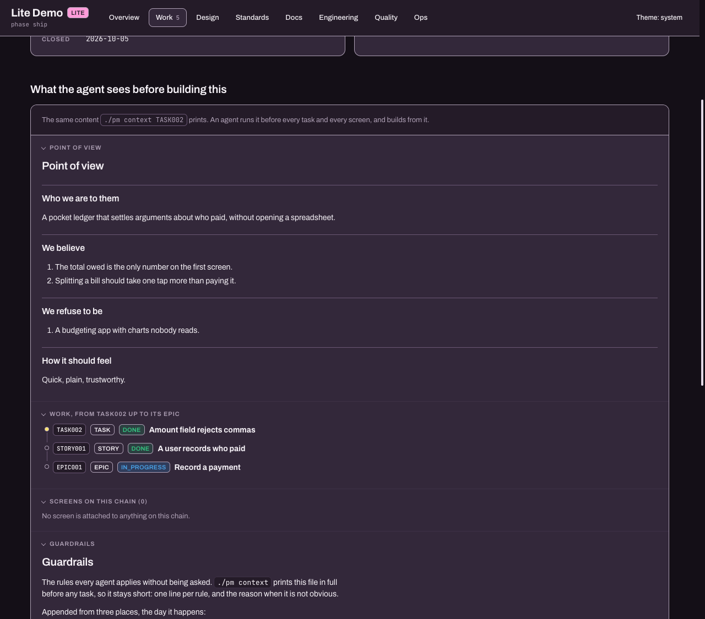

<p align="center">
  
</p>

<h1 align="center">Mandor</h1>

*Mandor* is Indonesian for site foreman. The workers build, the mandor checks the work
holds before anyone moves on. Here the workers are AI agents.

A project template for building with agents, built around one idea: **the chain has to
hold**.

An epic links to stories, which link to tasks and screens, which link to commits and
tests and a deployment, and feedback links back to a change request that updates the
decisions. Every link has an ID and a status. Nothing advances past a phase whose gate
nobody approved.

That is the whole product. Everything below is how it works.

## Requirements

- `python3` 3.8 or newer. `pm` is one file, stdlib only, nothing to install.
- [Claude Code](https://claude.com/claude-code) for the `/pm-*` skills and the session
  briefing. The `pm` CLI and the dashboard work without it, and `CLAUDE.md` is also read
  as `AGENTS.md` by other agents.
- `git`.

## Start

Press **Use this template** on GitHub, or copy it by hand:

```bash
cp -r mandor ~/Code/<name>-pm && cd ~/Code/<name>-pm
rm -rf .git && git init && ./pm hook   # the template's history is not your project's history
./pm init "<Project Name>"             # add --lite for a prototype or a one session build
```

Then open Claude Code in the folder. A `SessionStart` hook greets you with the current
phase, what is blocking, and the one command that moves things forward, so you never have
to remember where you left off. On a brand new project it tells you to run `/pm-new`. It
will interview you until the objective and the point of view are unambiguous, and it will
not let you skip that.

**What runs on its own.** `.claude/settings.json` runs `./pm brief --hook` when a Claude
Code session opens here, and `./pm hook` installs a git `post-commit` hook that runs
`./pm commit-hook`. Both only read and write `project.db`. Read `pm` before trusting it,
it is one file.

## What is where

| Path | Holds |
|---|---|
| `standards/` | Point of view, tokens, patterns, guardrails. What every agent applies. |
| `code/` | Your code repo, nested and gitignored. Created by you, connected by `./pm link code`. |
| `project.db` | Every ID, status, link and timestamp. SQLite. Committed. |
| `pm` | The only thing that writes to it. python3, stdlib only, no install. |
| `docs/` | Prose. Why, not status. See [`docs/index.md`](docs/index.md). |
| `.claude/skills/` | The eleven `/pm-*` commands, one per phase. |
| `.claude/settings.json` | The SessionStart hook that briefs you when a session opens. |
| `design-prototypes/` | Plain HTML, where design happens before it becomes code. |
| `dashboard/` | Reads `project.db` in the browser. No backend, never stale. |
| `CLAUDE.md` | How the agent behaves. Read by non-Claude agents as `AGENTS.md` too. |

Markdown is good at *why* and bad at *status*. A database is the reverse. Nothing is
stored in both.

## Where the code lives

In `code/`, inside this folder, as its own git repo. The PM repo ignores it, so the two
keep separate histories, but you open one folder and the agent sees the docs, the
standards and the code together.

```
my-project/                  this template, the PM repo
├── pm                       project management cli
├── project.db               state
├── docs/                    prose
├── standards/               point of view, tokens, patterns, guardrails
├── dashboard/               read only views
├── design-prototypes/       where a screen is designed before it is code
└── code/                    your stack, its own git repo, in .gitignore
    ├── CLAUDE.md            gets a block from ./pm link
    └── .git/hooks/post-commit   calls ../pm, stamps TASK004
```

```bash
git init code          # or: git clone <your code repo> code
./pm link code
```

`./pm link` installs the commit hook in the code repo, writes a block into its
`CLAUDE.md`, gives it the session briefing, and adds `/code/` to `.gitignore`. Every path
it writes is relative, so the pair survives a move. Git does not clone hooks, so run
`./pm link code` again after cloning the code repo fresh.

The code repo can also live anywhere else (`./pm link ~/Code/my-project`), it just gets
absolute paths. Or skip `code/` entirely and commit code into this repo: the PM repo's own
hook stamps work items too.

## Standards

The answer to "AI builds the most probable version". Four files the code repo reads:

| File | Holds | Filled by |
|---|---|---|
| `standards/point-of-view.md` | Who we are to the user, what we believe, what we refuse to be | `/pm-new` |
| `standards/tokens.css` | Every raw value. The only file allowed one | `/pm-design` |
| `standards/patterns/` | Full templates and flows, not just components | `/pm-design`, per first-of-kind screen |
| `standards/guardrails.md` | One line rules, from approvals, edit passes and mistakes | everyone |

`standards/design-system.md` holds the rules that tie them together. `./pm check` fails
past intent while the point of view is unfilled.

## The phases



Every box is a phase with a gate. The thick arrow is lite mode, which jumps from intent
straight to build. `/pm-change` can enter at any point when scope moves.

Lite (`./pm init "<name>" --lite`) is for one or two session builds, prototypes and
internal tools. It drops the planning gates and keeps the point of view and the edit
pass. `./pm mode full` upgrades later.

| Command | Ends when |
|---|---|
| `/pm-new` | The agent restates your objective and you confirm it |
| `/pm-discover` | You accept the risk register and the adopt or avoid list |
| `/pm-spec` | You approve the epic and story breakdown, and the M0 cut line |
| `/pm-flows` | Flows and every screen state are inventoried, per epic |
| `/pm-design` | Design system approved, then each screen approved on its own |
| `/pm-build` | Milestone tasks done and reviewed |
| `/pm-edit` | Every delivered epic played as a user, fixed, approved by a named editor |
| `/pm-ship` | Checks green, deployed, smoke tested |
| `/pm-feedback` | Every feedback item triaged into somewhere real |
| `/pm-change` | A mid-flight scope change is applied and the docs match again |
| `/pm-status` | Never, it only answers |

Full detail in [`docs/method.md`](docs/method.md).

## Two things that make it stick

**Gates are hard blocks.** `./pm phase next` refuses while a gate is unapproved, and the
agent is instructed to refuse too. You can always override, and the override is recorded
and shown on the dashboard:

```bash
./pm gate skip design "internal preview, checkout screen gets redone after"
```

**Scope changes go through `/pm-change`.** It computes what the change touches, shows you
before it edits anything, then updates the area TRD, writes or supersedes an ADR, cuts or
re-parents work items, and marks affected screen approvals stale. A doc that no longer matches the
product is worse than no doc, because someone will trust it.

## Work is one tree

Jira shaped, four levels, and only the top two get documents.

```
milestone M0
  L0 epic     EPIC001   a slice of product      doc: docs/product/epics/
    L1 story  STORY001  what a user gets        doc: docs/product/stories/
      L2 task     TASK001   a unit of build work    description field
        L3 sub-task SUB001    a slice of a task       description field
```

```bash
./pm epic  title="Quick capture" milestone=M0
./pm story title="A user can capture a note in under two seconds" parent=EPIC001
./pm task  title="Capture input component" parent=STORY001 type=impl
./pm tree
```

A milestone groups one or more epics, because a milestone is a target, not a bucket of
tasks. A story is the level tests speak about: it reaches `verified` only when a passing
test run names it. A parent cannot close while a child is still open.

## Documents are split by focus

One growing `prd.md` works for about a month, then it is 900 lines and nobody edits it.

- `docs/product/overview.md` and `docs/engineering/architecture.md` are the helicopter
  views. They stay short and link down.
- `docs/product/epics/EPIC001-<slug>.md`, one per epic.
- `docs/product/stories/STORY001-<slug>.md`, one per story.
- `docs/product/screens/SCR001-<slug>.md`, one per screen.
- `docs/engineering/trd/<area>.md`, one per subsystem.
- `docs/engineering/adr/NNNN-<slug>.md`, one per decision, immutable once accepted.

Tasks and sub-tasks carry a `description` in the database instead. Templates for the rest
are in `docs/_templates/`.

## The pm CLI

```bash
./pm status                        where are we, and what is next
./pm brief                         the session-start briefing, and the next command
./pm check                         run every invariant, exit 1 on a real problem
./pm phase next                    advance, if the gate allows it
./pm gate approve spec "<note>"    close a gate with a name attached
./pm tree [CODE]                   the work tree, indented
./pm context TASK004               point of view, work chain, screens, guardrails for one item
./pm link code                     connect the code repo (nested, or any path)
./pm mode [full|lite]              show or switch the phase set
./pm epic|story|task|sub ...       create a work item at the right level
./pm set TASK004 status=done
./pm q "SELECT code,title,status FROM work_item WHERE level=1"
./pm demo                          self check, runs against a scratch database
```

`./pm check` is the one that matters. It fails on a work item with no parent, an epic in
no milestone, an epic nobody broke down, a parent closed above an open child, a story
marked verified with no passing test covering it, a screen whose approval went stale, a
delivered epic nobody edited once the project is past edit, an unfilled point of view, or
an open gate on the current phase. Nothing is done until it passes.

The git `post-commit` hook stamps task codes found in commit messages:

```
feat: render the inbox empty state TASK004
```

That moves TASK004 to `review` and records the sha. Instructions to update a task board get
skipped, hooks do not.

## Dashboard

| Overview | Standards | What the agent sees |
|---|---|---|
| [](docs/images/dashboard-overview.png) | [](docs/images/dashboard-standards.png) | [](docs/images/dashboard-context.png) |

```bash
python3 -m http.server 4321      # from the repo root
# open http://localhost:4321/dashboard/
```

Eight views: overview, work, design, standards, docs, engineering, quality, ops. It loads
`project.db` directly with sql.js, so it is never out of date with the database. The header
shows the project's mode (full or lite), and a strip under it appears on every page while
`./pm check` would fail.

- **Overview** is the one page view: stat tiles, the phase pipeline (the lite phase list in
  lite mode), the edit pass per epic (gate, editor, note, date, fix tasks open and closed),
  the linked code repo with the last commit that stamped a work item, a cumulative delivery
  line, work per epic by status, test results per suite, milestone rollup and recent
  activity. Every tile and chart expands into a dialog with the breakdown. It leads with
  whatever `./pm check` would fail on, including a delivered epic nobody edited.
- **Work** has a board and a list, with search, level, epic and milestone filters, and
  pagination. Every item has its own page showing the whole subtree under it, its screens,
  the feedback pointing at it, its document, an edit pass card on epics, and what the agent
  sees before building it: the same point of view, chain, screens and guardrails
  `./pm context <CODE>` prints. Read only: statuses change through `./pm`.
- **Design** has two tabs. The system tab renders specimen cards from `@dsCard` markers in
  `design-prototypes/`, grouped, with usage notes, the same convention Claude Design uses.
  The screens tab opens each screen full size with its states, approval reason and context.
- **Standards** shows the point of view (or a warning while it is unfilled, since
  `./pm check` fails past intent then), swatches read live from `standards/tokens.css` with
  light and dark values side by side plus radii and fonts, the guardrails, and the patterns.
- **Docs** renders every markdown file in the repo, `standards/` included, with a tree,
  breadcrumbs, a table of contents and backlinks. Links between documents resolve inside the
  dashboard.
- **Engineering** carries the areas map (what each subsystem owns and must never write),
  the decision log with supersede chains, the debt register harvested from every area TRD,
  and the interface and data model index.

Every code rendered anywhere is a chip that routes back to its own source, so nothing on
the page is a dead end.

The look comes from the Perch design system, vendored under `dashboard/vendor/perch/` with
its fonts (Archivo and JetBrains Mono), so the whole thing works with no network. Perch
ships light only; `dashboard/dashboard.css` adds the dark theme. The page follows the OS
setting until you pick light or dark with the theme button in the header.

## Not in scope, on purpose

No server, no ORM, no migration framework, no sprints, no velocity, no story points, no
time tracking, no Jira sync, no web write path. If this ever needs a running backend,
something went wrong.

## License

MIT, see [`LICENSE`](LICENSE). Vendored libraries and fonts are listed in
[`THIRD_PARTY.md`](THIRD_PARTY.md).
